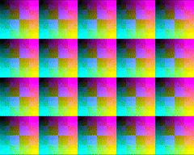
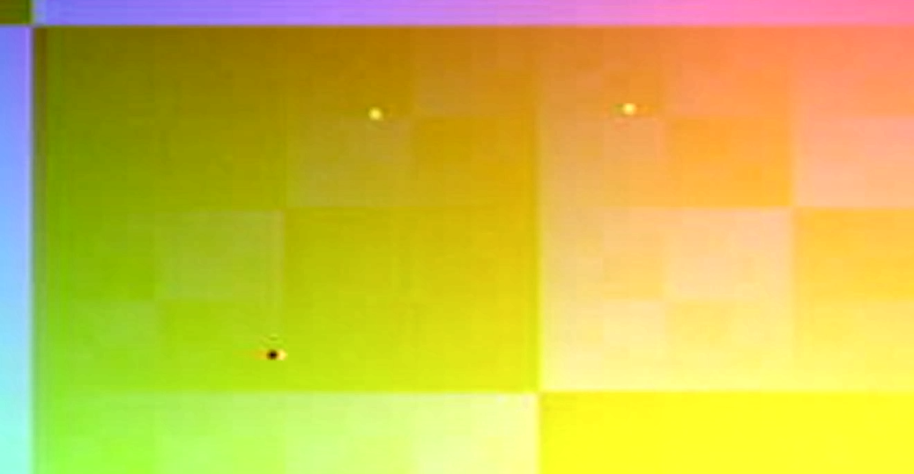
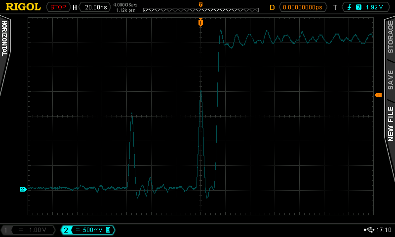
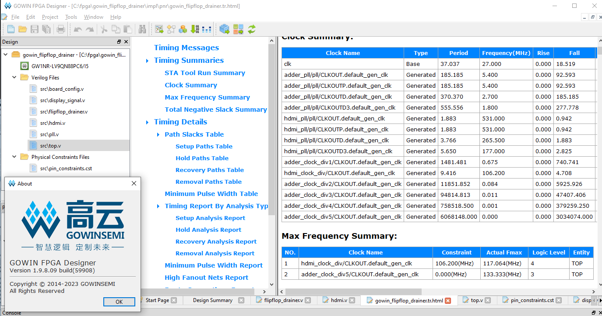

# Gowin Flipflop Drainer

**2023/01/03**

I have been working on my FPGA project for about a year and a half, based on the Sipeed proto dev boards. Everything went smoothly at first, but for the past six months, I have been running into mysterious instabilities, which manifest in video signal instabilities (my HDMI project performs video output at high resolutions).

For a long while, I was hunting ghosts in my design, timing analysis, or other possible problems. The only common pattern I observed was that *if I kept my design small, things would work properly on the Sipeed boards*. After extensive testing, I boiled it down to this test case.

This repository contains a test project that illustrates a suspected hardware failure of the Sipeed Tang Nano 4K, 9K and Primer 20K boards (Gowin FPGAs).

When outputting a DVI-D video signal, for example 768x576@75Hz @ with 45.51 MHz pixel clock (227.55 MHz 5:1 PLL clock) or higher, the video output signal from the Gowin FPGA will become unstable when the size of the design otherwise grows past an unspecified threshold.

When a resolution with a slower pixel clock, such as 800x600@60Hz @ 39.96 MHz or 640x480@60Hz @ 25.20 MHz is used, video is not observed to completely desynchronize, but there will be infrequent individual pixel flickering color glitches in the output image, as observed in the above screenshot.

To demonstrate the problem, this design implements a simple static test image DVI-D output, with the addition that the file `flipflop_drainer.v` implements a long sequence of nonsense adders to fill up unused flipflop resources of the board. This simulates a design "growing in size". When enough flipflops are in use (for example, on Nano 9K, ~28% or more, i.e. ~300 adders), the Sipeed boards will fail to produce a stable DVI-D video signal out at such a high pixel clock speed, and one is forced to either reduce the size of the design, or reduce the output video resolution.

In all cases, timing analysis in the Gowin IDE passes, so this is not a timing closure related problem. The cause of the failure is currently unknown.

## Suspected Causes

A few different root causes are suspected. The first, and the most obvious one is that this might be a programming error after all, and something in the design in this repository is not properly implemented. I have diligently examined every line of the design, and think to my best abilities that this should not be a developer error, but cannot naturally 100% rule this out.

Excluding software causes, this leaves following types of hypotheses:

- ~~maybe the most likely hardware cause is that the power supply on the Sipeed Tang boards is not enough to provide the necessary power for the FPGA, and it suffers from a "brownout". This has not been confirmed or disproven yet though.~~ **Update 2023/01/06**: This cause does not seem likely. Adjusting values of board capacitors does not seem to exacerbate or mitigate the issue, and the issue is already observed to occur at low video pixel clock speeds, such as 12.5 MHz or 25.2 MHz.

- ~~one fringe possibility is that maybe there is some kind of internal electromagnetic interference that is generated to the LVDS serialization circuitry when the number of used flip flops in the design grows. This is a wild theory at this point.~~ **Update 2023/01/06**: This theory has been disproven. The issue does already occur when bypassing the OSER10 and LVDS blocks altogether, and just observing the video signal (hsync, vsync, display_enable) driven to an IO output pin.

- ~~a remote possibility is that maybe there is an issue in the Place and Route tool, which manifests with a higher probability when the size of the design grows, causing the netlist to be incorrectly routed. Although I don't know enough to conclude that either.~~ It looks like driving the nonsense adder chain with a clock signal that never triggers (while still having the adder chain in the netlist), does not exhibit the problem. So it is safe to conclude that this issue is not caused by a bug in Synthesis or Place and Route tool.

- **Update 2023/01/06**: The most likely cause at this point suggests that there is noticeable crosstalk/interference that is occurring between different computational units ("flipflops") inside the FPGA, which becomes much more prominent when the clock speed increases. This crosstalk causes ghosting to the neighboring cells, which can lead to a bit being incorrectly flipped in a cell. Outputting a video signal at 12.5 MHz pixel clock speed has been observed to contain this kind of ghosting (although at 12.5 MHz not yet enough to actually flip a bit). Note that this is not at all conclusive, but only a guess. A screenshot of this ghosting is shown in the above screenshot, which displays the video hsync signal before entering hsync (active high). Observe the spikes in this signal that precede the actual trigger event, which have no apparent reason as to what would cause them.

The following observations have been made:

- The issue occurs on Tang Nano 4K, Tang Nano 9K and Tang Primer 20K, although for each board, the number of flip flops needed to trigger the issue varies. (see the top of `flipflop_drainer.v` for details)

- Depending on the pixel clock speed, the video signal sync either completely vanishes, or there will be individual color pixel glitches that flicker in the image at random frames.

- When the issue occurs, The issue is not caused by the PLL lock being lost, i.e. the PLL lock does stay good throughout the run, even if there is no video sync, there is still a good PLL lock.

- In `flipflop_drainer.v` one can vary the number of nonsense adders that is used in the design by adjusting the register `aXXX` that is referenced in the addition. There is a smooth ramp of `< K` adders: stable signal, `K < x < M` adders: unstable signal, `> M` adders: black image, no sync at all, i.e. the more adders, the more likely the video sync will glitch, and at some point, video sync will vanish completely.

- Reducing the output video pixel clock speed (smaller resolution or smaller refresh rate) will mitigate the issue. Lowering to 1280x720 with 74.25 MHz pixel clock is not enough, the sync issue will persist there; though lowering to 640x480 with 25.2 MHz pixel clock will avoid the sync issues (**Update 2023/01/06**: but there are still observed color pixel glitches at that speed).

- Also reducing the frequency that the additions are performed will mitigate the issue, although one must reduce the frequency by a great deal to make the video signal stable, e.g. down to < 20Hz. (change the clock signal in instantiation of `flipflop_drainer` in `top.v`)

- On Tang Nano 9K, having a 600 additions long adder chain ticking at 154 Hz gives an unstable video signal. Splitting this half to 300 additions yields mostly stable video signal. Instantiating two 300 adders long adder chains, where one adds on the posedge of the 154 Hz clock, and the other on the negedge of a 154 Hz clock, yields again a stable image. This suggests that the root cause would be a peak power draw problem, which the power supply would not be adequate to feed.

## How to run

The repository has been written to be ready for Tang Nano 9K out of the box.

To reproduce the issue, build and run the project on your Tang Nano 9K board. To see that there should be a stable video underneath all of this, i.e. to reproduce a working video signal, edit file `src/flipflop_drainer.v`, and uncomment the line marked with `// Uncomment this line`.

If you want to test the issue out on Tang Nano 4K, do
1. edit `src/board_config.v` and uncomment line `define GW1N4` and comment out the other lines.
2. edit `src/pin_constraints.cst` and uncomment the section related to Tang Nano 4K pinouts, and comment the other sections.
3. after opening `gowin_flipflop_drainer.gprj` project in Gowin FPGA Designer IDE, double-click on the device line in the project Design tab, and choose `"GW1NSR-LV4CQN48PC7/I6"` in the list.

If you want to test the issue out on Tang Primer 20K, do
1. edit `src/board_config.v` and uncomment line `define GW2A` and comment out the other lines.
2. edit `src/pin_constraints.cst` and uncomment the section related to Tang Primer 20K pinouts, and comment the other sections.
3. after opening `gowin_flipflop_drainer.gprj` project in Gowin FPGA Designer IDE, double-click on the device line in the project Design tab, and choose `"GW2A-LV18PG256C8/I7"` in the list.

## Questions

#### Isn't this just a timing closure problem? Fix your timings!

No, timing analysis is undertaken by the Gowin Analyzer, and it looks proper and comes out "blue" in the analyzer (in Gowin IDE, red heading text highlights timing errors).

Timings are met.

#### Isn't this test case too contrived to be representative for real world use?

The reason that I started looking into this in the first place was that my Sipeed-based project has run into random video sync problems, and the only common cause I could understand was that my project "got too big". Removing enough sub-features from my project would magically fix up the issue. So I am observing this kind of behavior in the real world.

However my application does not perform lots of additions every clock cycle. That being said, the Tang Primer 20K is marketed for "AI" and "Deep Learning", so it would be quite realistic for those types of use cases to fill up a FPGA with many parallel operations on large matrices, i.e. perform large multiply-and-add operations.

#### Is this a problem with Sipeed boards only, or are all Gowin FPGAs affected?

~~I don't know. It could be that the root issue is with Sipeed's power delivery, or it could be that the issue is with internal power management inside Gowin FPGAs themselves. I will update once more information becomes available.~~

**Update 2023/01/06**: It looks like this issue affects Gowin FPGAs in general, and it is not just an issue with Sipeed boards. We have been able to reproduce the issue using a FPGA chip that was sourced from Mouser, and using a custom PCB board.

#### Maybe your board is just a lemon? It happens.

So far I have been able to reproduce the issue on the following:
 - one Tang Nano 4K (GW1NSR-4C GW1NSR-LV4CQN48PC7/I6)
 - three Tang Nano 9Ks (GW1NR-9C GW1NR-LV9QN88PC6/I5)
 - two Tang Primer 20Ks (GW2A GW2A-LV18PG256C8/I7)
 - and two GW1NR-9 GW1NR-UV9QN88PC6/I5 chips from Mouser

In other words, all copies of Gowin FPGAs I have so far suffer from this issue.

#### Is the new Tang Nano 20K affected?

(Tang Nano 20K: https://twitter.com/sipeedio/status/1582337787574951938?lang=en )

I don't know. I don't have one to test. I have tested that Tang Nano 4K, Tang Nano 9K and Tang Primer 20K all do suffer from this issue though.

## Workarounds/Solutions

This section lists different workarounds that I know about:

- **Keep the size of your design small.** On Tang Nano 9K, using less than 30% of the resources should do the trick. I have not observed correctness issues whatsoever in small designs.
- ~~Reduce the video pixel clock speed. A 74.25 MHz pixel clock speed is still too fast, but e.g. a 25.2 MHz 640x480 VGA pixel clock speed does not seem to be affected by this issue.~~ **Update 2023/01/06**: the issue does actually reproduce even on 25.2 MHz pixel clock speed, but it requires a keen eye to spot the individual glitching pixels in the output.
- Subdivide the computation in your design in half between positive and negative clock edges of the same clock. This seems to mitigate the issue, suggesting a peak power draw problem. See the branch [pos_and_negedge_adders](https://github.com/juj/gowin_flipflop_drainer/compare/main...pos_and_negedge_adders) for details. (yes, this can be really hard to pull off in practice)

If a solution becomes available, I will update this section.

## Discussion

Please visit the following forum threads to find conversation about the problem:
 - https://www.reddit.com/r/FPGA/comments/101pagf/sipeed_tang_nano_4k_9k_gowin_fpgas_become/
 - https://www.reddit.com/r/GowinFPGA/comments/101p9yd/sipeed_tang_nano_4k_9k_gowin_fpgas_become/

In closing, I hope this will turn out to be salvageable in some way, I really **really** enjoy working with Gowin FPGAs, in so many ways programming against these boards has felt like working on the Raspberry Pi of FPGAs - and I would not give that compliment lightly!
